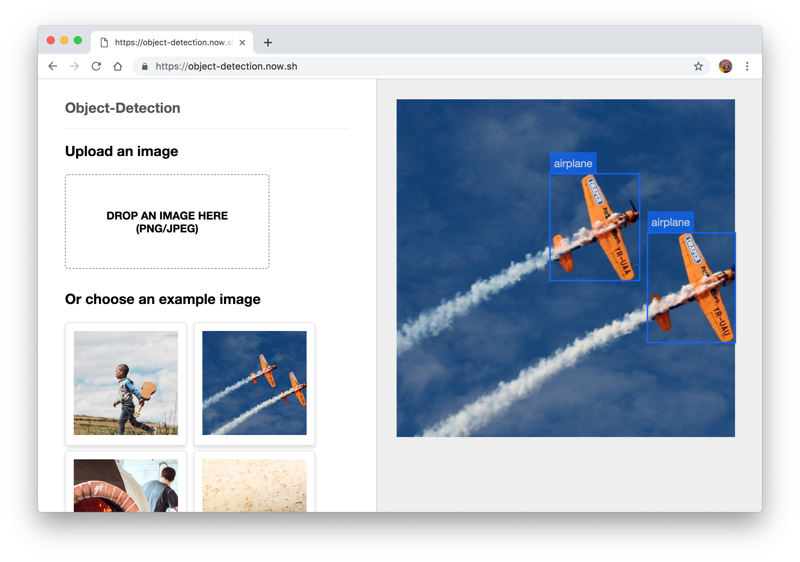
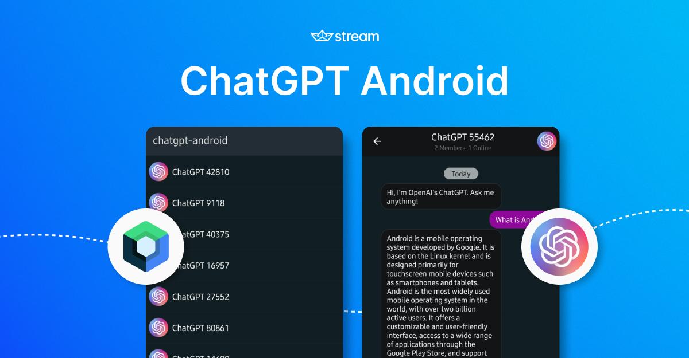

# 👋 Welcome to My GitHub Profile

Hi there! I'm an AI Engineer passionate about leveraging cutting-edge deep learning algorithms to solve complex problems.

## 🧠 About Me
- 📊 Experienced in developing intelligent systems, data processing, and predictive modeling.
- 💡 Enthusiast of deep learning, computer vision, natural language processing, and reinforcement learning.
- 🎓 Graduated with a degree in Bachelor of Science in Computer Science.

## 🛠️ Skills
- **Programming Languages**: Python, R, C++, Java
- **Frameworks & Libraries**: TensorFlow, PyTorch, Keras, Scikit-learn, OpenCV, NLTK, SpaCy, Pandas
- **Tools & Platforms**: Jupyter, Google Colab, AWS, Azure
- **Databases**: SQL, MongoDB, PostgreSQL
- **Other**: Git, Docker, Linux, Bash scripting

## 🚀 Projects

- **[Object-Detection](https://github.com/phantomwork/object-detection)**: Developed a machine learning model to detect fraudulent transactions with 98% accuracy using logistic regression and random forests.

  

- **[Image_Classification](https://github.com/phantomwork/Image_Classification)**: Built a convolutional neural network (CNN) to classify images from the CIFAR-10 dataset with TensorFlow and Keras.

  

## 📈 GitHub Stats

## 🌐 Connect with Me
- [Medium](https://medium.com/@fredqvarnstrom1)
- [Email](fredqvarnstrom1@hotmail.com)

---

⭐️ From [phantomwork](https://github.com/phantomwork)
